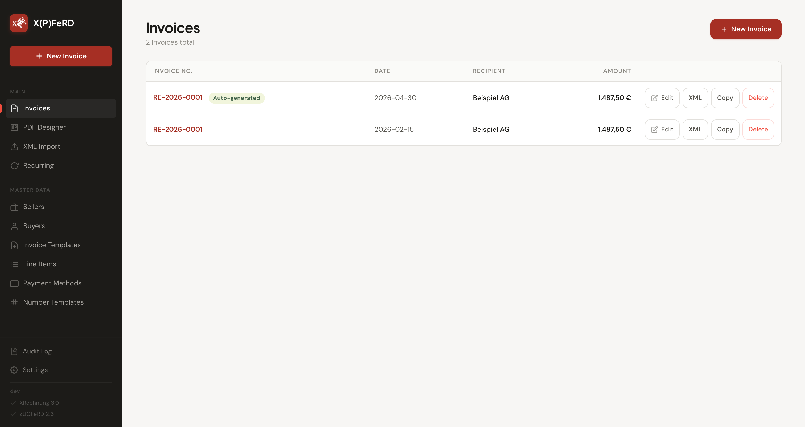
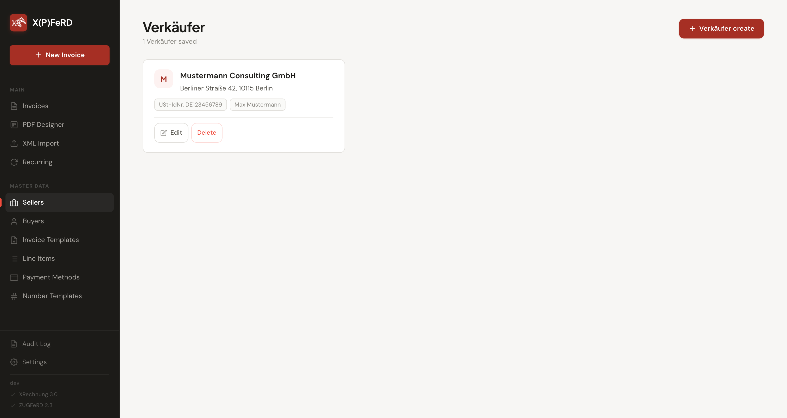
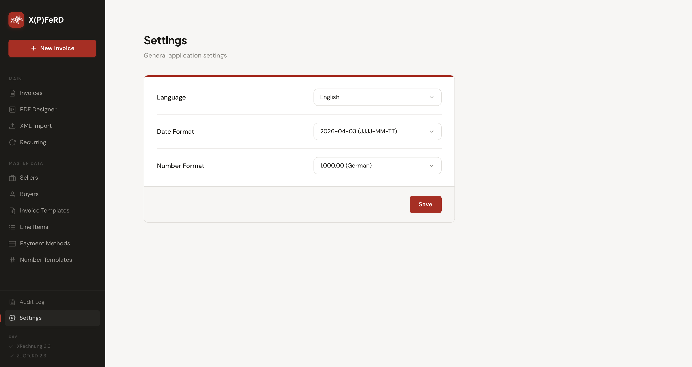
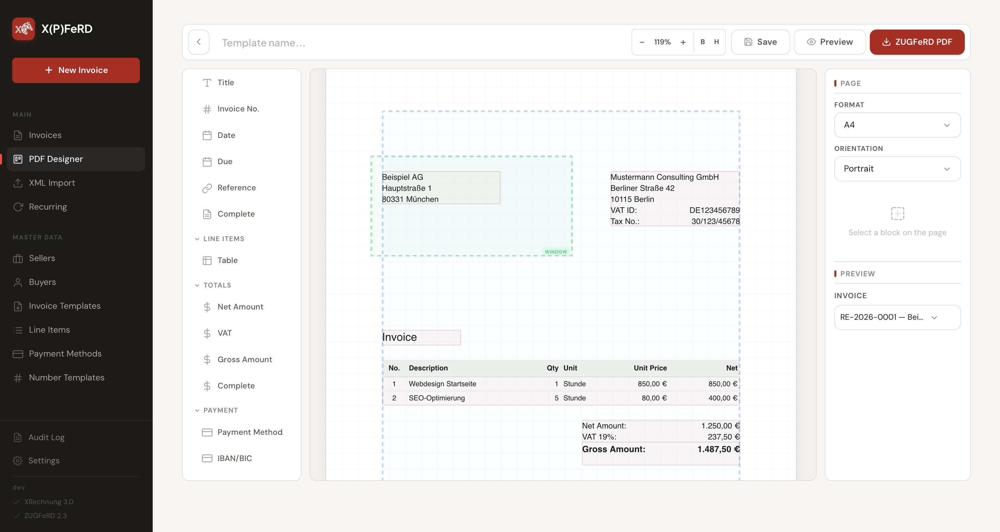

<p align="center">
    
</p>
<p align="center">
  <a href="https://github.com/tiehfood/xpferd/releases/latest">
    
  </a>
  <a href="https://hub.docker.com/r/tiehfood/xpferd">
    
  </a>
  <a href="LICENSE">
    
  </a>
  <a href="https://github.com/tiehfood/xpferd">
    
  </a>
  <a href="https://www.buymeacoffee.com/tiehfood">
    
  </a>
</p>

# X(P)FeRD

I needed a simple application for creating, managing and exporting XRechnung XML and ZUGFeRD PDF invoices (German e-invoicing standard).
Especially a simple WYSIWYG PDF designer was something I was looking for but couldn't find an existing solution I liked.
So I build this little app.
It's probably not perfect as my testing data is limited but feel free to report any issues or submit PRs if you want to contribute.

I will be honest about the usage of AI. It assisted me in this project, but it's still nothing, you create with just two or three promts. There went some serious thinking in it, particularly in the features.

About the name: The "X" was taken from XRechnung obviously and part of ZUGFeRD is so closely to "Pferd" (Horse) in german, so I combined both and made an "XPferd" out of it.

## Features

- Create and edit invoices with all legally required fields for Germany
- Export invoices as XRechnung 3.0 compliant XML
- Design single page invoice PDF with WYSIWYG editor
  - Support for SVG logos
  - Use custom fonts (TTF/OFT)
  - Custom and common help lines (including envelope window, folding marks and borders)
- Export invoices as ZUGFeRD 2.1 compliant PDF (with embedded XML)
- Duplicate invoices or create from templates
- Swagger API documentation at `/api-docs`
- Support for Germany and English language

## Screenshots
|  |  |
|:---------------------------------------------:|:---------------------------------------------:|
|  |  |


## Docker images
**Latest image**: `tiehfood/xpferd:latest`  
**Specific version**: `tiehfood/xpferd:v1.0.2`

## Quick Start

```bash
# Development
docker-compose up dev

# Production
docker-compose up production

# Minimal
docker run --rm -it -v xpferd:/app/data -p 3000:3000 tiehfood/xpferd:latest
```

The app is available at `http://localhost:3000` for production.

## Manual Docker Setup

```bash
# Build the dev image
docker build -f Dockerfile.dev -t xrechnung-dev .

# Start a persistent dev container
docker run -d --name xr-dev \
  -v "$(pwd):/app" \
  -p 3000:3000 \
  xrechnung-dev

# Install dependencies
docker exec xr-dev pnpm install

# Build the frontend
docker exec xr-dev node build-client.js

# Start the server
docker exec xr-dev npx tsx src/server/index.ts
```

## Running Tests

```bash
docker exec xr-dev npx vitest run
```

Or via Docker Compose:

```bash
docker-compose run --rm test
```

## Frameworks & Libraries
- **Application:** TypeScript, Svelte 5, Express
- **Database:** SQLite
- **PDF Generation:** @libpdf/core
- **XML Generation:** xmlbuilder2 (UBL 2.1 / XRechnung 3.0)
- **API Documentation:** Swagger-UI (`/api-docs`)

## Credits
 - [XRechnung 3.0](https://xeinkauf.de/xrechnung/versionen-und-bundles/)
 - [ZUGFeRD 2.1](https://www.ferd-net.de/standards/zugferd/)